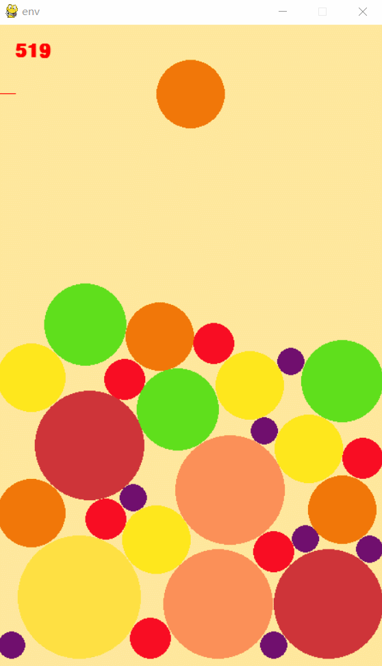

# Synthetic Big Water Melon

A project using DQN(Deep Q-learning Network) to play the game Synthetic Big Water Melon

**Note:**
    Now, the DQN doesn'work well, and I'm trying to find a way to make it work. I will also try other algorithms if the result is always not good.

### Game Demo

The game is based on [pygame](https://www.pygame.org/news) and [pymunk](http://www.pymunk.org/en/latest/).



## Mode

**1) human play**

```
python play.py --rl False
```

**2) DQN play**

```
python train.py --rl True
```

